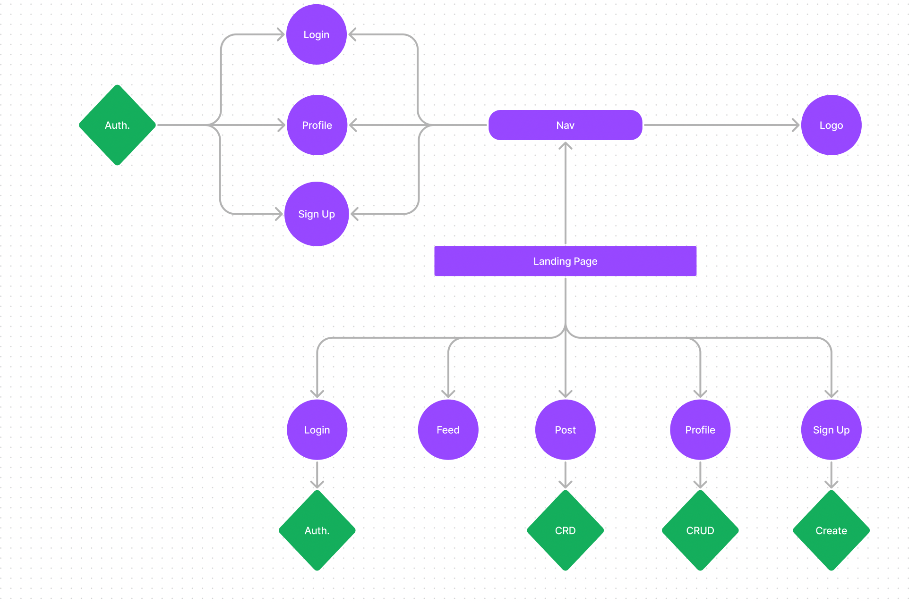
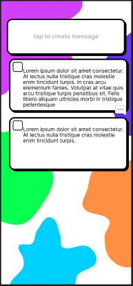

# Talkin' Smack

[Netlify Link](https://genuine-marshmallow-56fd7d.netlify.app/)

[Link to Back-End Repo](https://github.com/SEI-Buffleheads/talkin-smack-be)

[Link to Railway](https://talking-smack-2be-production.up.railway.app/)

## Overview

### Brand Statement

A social media site so you can talk smack with your friends (or frenemies). On the Talkin' Smack landing page, You are prompted to sign in or sign up. Once on the home screen, there is an area at the top of the page to make a post. Below that is the users feed, showing posts from friends. 

## Team Members

- Lin Lin
- Martin G.
- Danny P.
- Caprice G.
- Chelsea D.
- Malik W.
- Ethan L.
- Luis S.
- Alexis H.
- Akeel K.

## Component Hierarchy

---

## Wireframes & Branding

 

---

## Team Expectations

[Team Expectations](https://docs.google.com/document/d/1Xx20AwDrqMAbPI8asQM6VqsE0kDwz8gCpUQG7W3NIfI/edit?usp=sharing)

## Content Management

[GitHub Projects](https://github.com/orgs/SEI-Buffleheads/projects/3/views/1?layout=table)

---

## MVP GOALS

- Backend
  - Use Flask and PostgreSQL
  - JSON API built with Django
  - User Authentication
- Use React to create the front-end
  - Use at least 5 functional components
  - Communicates with backend RESTfully
- Give user capability for full CRUD (profile, posts)
- Deploy to Railway and Netlify
- CSS styling to match wireframe and branding
  - Responsive Design

## POST MVP GOALS

- Smack and SmackDown buttons
- For You Page
- User Image
- Search functionality

## Project Schedule

| Date      | Deliverable                                                |   Status   |
| :-------- | :--------------------------------------------------------- | :--------: |
| Nov 21     | Wireframes + Final Project Approval                       |  Complete  |
| Nov 22     | Basic Front End, Back End Deployment                       | Complete |
| Nov 28     | Continue Back-End + Testing + Develop Front-End Components | Complete |
| Nov 29     | Continue Back-End + Testing + Develop Front-End Components | Complete |
| Nov 30     | React Front-End MVP + CSS Styling                          | Complete |
| Dec 1      | Refine CSS and proceed with Post-MVP Improvements          | Complete |
| Dec 2      | Present and Celebrate                                      | Incomplete |
